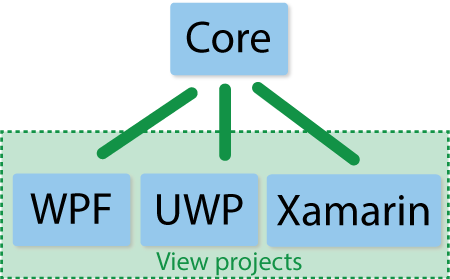

# Introduction

Live-Charts is an open source project licensed under the [MIT license](https://opensource.org/licenses/MIT), it started as an alternative to pricy libraries, the idea is to build a solid, flexible and easy to use framework to visualize data in as many ways as possible.

The library updates automatically as your data changes in real time and you should be able to customize everything in your plot.

The project also includes a paid version in order to improve performance.

## LiveCharts.Core

To generate a chart we need to calculate every shape, lets say you need a bar chart, LiveCharts.Core is in charge to calculate the position and the dimensions of every bar, and of course not only bars, it calculates every shape in the UI.

LiveCharts.Core is a dotnet Core project, thus it should also contain all the code that is not platform specific, then we can reuse as much code as possible.

The core only generates models for every shape, it has no idea how to draw a it in the UI, thus the core provides a dependency injection pattern, so a consumer (the view) could inject the logic to specify how a shape is drawn in the UI.

## LiveCharts.WPF

The WPF version draws the shapes indicated by LiveCharts.Core using the [shapes](https://docs.microsoft.com/en-us/dotnet/framework/wpf/graphics-multimedia/shapes-and-basic-drawing-in-wpf-overview) defined by the WPF framework.

## LiveCharts.WPF.SeriesFramework

This is the high performance framework that connects directly with the open source library by changing only one line of code, this project is not open source but it has a low price compared with most of the alternatives.

WPF is based on DirectX and it does have a good performance, but is has also to be flexible so we users of the framework can achieve our goals, but when you are using LiveCharts.WPF.SeriesFramework the control is no longer being drawn by WPF, we are drawing it using DirectX also, bu the difference is that we optimize everything for our needs, resulting in a huge performance buff.

Besides that we lazy load the data as the user requires it, based on many parameters such as the chart size, current zoom, current pan and series type.

